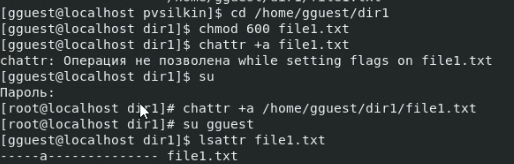

## Цель работы

Получение практических навыков работы в консоли с расширенными атрибутами файлов.

## Выполнение лабораторной работы

1. От имени пользователя gguest просмотрели наличие расширенных атрибутов файла file1.txt. 

   

2. Установили права 600 на file1, при попытке добавить расширенный атрибут а к file1 от имени пользователя владельца получили отказ. Таким образом, устанавливать и снимать расширенные атрибуты файла можно только от имени администратора, что нам и удалось сделать.

   

3. Удалось добавить в файл дополнительную информацию с помощью команды .

   ```
   echo "test" >> /home/gguest/dir1/file1.txt
   ```

   Однако, при попытке перезаписать информацию, получили отказ. Попытка переименовки файла, а также установка на него других прав - также не удалась.

   


4. Далее, с помощью учетной записи суперпользователя, мы сняли расширенный атрибут а. Без расширенного атрибута, файл file1.txt позволил нам перезапись информации, переименовку файла, а также установку новых прав на файл.

   

5. Вернули значением 600 права для file1.txt

   

6. С помощью учетной записи суперпользователя добавили для файла новый расширенный атрибут - i. Попытались выполнить все предыдущие команды, которые были применены к file1.txt, при обработке каждой из них получили отказ.

    

Таким образом, расширенный атрибут "a" позволил нам выполнять до запись информации в файл. Расширенный атрибут "i" блокировал все действия с файлом. Отсутствие расширенных атрибутов для файла, позволяло выполнять любые команды над ним.

## Вывод

В результате выполнения работы мы повысили свои навыки использования интерфейса командой строки, познакомились на примерах с тем, как используются основные и расширенные атрибуты при разграничении доступа.
