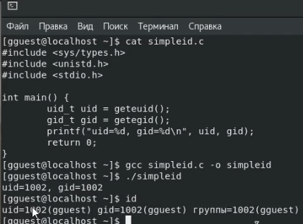
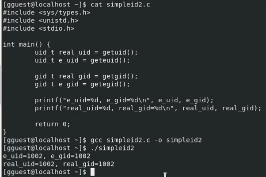

## Цель работы

Изучение механизмов изменения идентификаторов, применения SetUID- и Sticky-битов. Получение практических навыков работы в консоли с дополнительными атрибутами. Рассмотрение работы механизма смены идентификатора процессов пользователей, а также влияние бита Sticky на запись и удаление файлов.

## Выполнение лабораторной работы

0. Отключили систему запретов, проверили состояние. Проверили наличие компилятора gcc:

   

1. Создали программу simpleid.c, скомпилировали, выполнили. Далее, выполнили команду id. Программа, написанная на "си" произвела вывод двух идентификаторов: Uid and Gid. Системная команда id также вывела несколько таких же идентификаторов, которые полностью совпадали с предыдущими:

   

2. Написали усложненный вариант первой программы, скомпилировали, запустили, получили на выводе значения эффективных и реальных идентификаторов:

   

3. Сменили владельца данной программы с gguest на root, установили SetUID бит для данной программы. Выполнили проверку выполнения данных команд, команды были выполнены успешно, владельцем программы стал суперпользователь, для пользователя была установлена метка "s":

   

4. Запустили программу simpleid2. Так как ранее был установлен бит SetUID, то функция geteuid возвратила id пользователя, владеющего данной программой, т.е 0, т.е root. В то же время функция getuid возвратила id пользователя, запускающего данную программу, т.е 1002, т.е gguest. Системная команда id возвратила реальные и эффективные идентификаторы пользователя gguest, которые равны соответственно 1002:

   

5. Сменили владельца группы с gguest на root. Установили бит SetGID, проверили на расширенные атрибуты, установка была выполнена успешно:

   

6. При выполнении программы, написанной на "си", функция getegid вернула id группы, владеющей данной программой, т.е 0, т.е root. В то же время функция getgid возвратила id пользователя, запускающего данную программу, т.е 1002, т.е gguest. Системная команда id возвратила реальные и эффективные идентификаторы пользователя gguest, которые равны соответственно 1002:

   

7. Был создан и откомпилирован файл readfile.c:

   

8. Сменили владельца файла с gguest на root, убрали права на чтение и запись для группы и для остальных:

   

9. Выяснили, что на директории tmp установлен sticky-бит, об этом свидетельствует метка "t" в категории для остальных. От имени пользователя gguest был создан файл file01.txt со словом "test". Были просмотрены атрибуты файла и установлены права на чтение и запись у всех остальных:

   

10. Пользователю guest3, не являющимся владельцем файла, удалось прочитать файл, до записать его, а также перезаписать. Однако удаление было не разрешено в связи с установкой Sticky бита на директорию tmp, который позволяем всем писать в файл, читать его, но удаление возможно только для владельца:
11. 

12. С помощью повышения прав до суперпользователя был снят Sticky бит с директории tmp. Попытки выполнить все предыдущие команды без Sticky бита были успешными (на скриншоте опечатка при попытке выполнить до запись в файл, без опечатки команда выполняется успешно):

    

13. На директорию tmp был возвращен Sticky бит:

    

## Вывод

В данной лабораторной работе были изучены механизмы изменения идентификаторов. Были обнаружены изменения между реальными и эффективными идентификаторами и их поведением. Ознакомились с поведением компилированных программ, при применении к ним SetUID и SetGID - битов, а также с механизмом работы Sticky-бита.