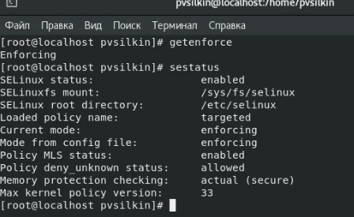
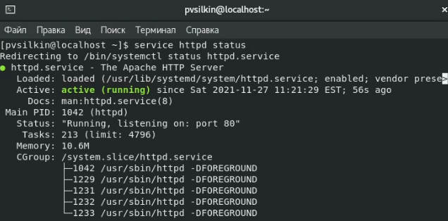

## Цель работы

Развить навыки администрирования ОС Linux. Получить первое практическое знакомство с технологией SELinux. Проверить работу SELinx на практике совместно с веб-сервером Apache.

## Выполнение лабораторной работы

Установим/обновим (за суперпользователя) веб-сервер Apache с помощью команды *yum install httpd*:

В конфигурационном файле */**etc/**httpd/**httpd.**conf* зададим параметр ServerName: *Server**N**ame* *test**.**ru* чтобы при запуске веб-сервера не выдавались лишние сообщения об ошибках, не относящихся к лабораторной работе:

Также необходимо проследить, чтобы пакетный фильтр был отключен или в своей рабочей конфигурации позволял подключаться к 80-му и 81-му портам протокола tcp. Добавим разрешающие правила с помощью команд: 

*iptables -I INPUT -p tcp --dport 80 -j ACCEPT*

*iptables -I INPUT -p tcp --dport 81 -j ACCEPT*

*iptables -I OUTPUT -p tcp --sport 80 -j ACCEPT*

*iptables -I OUTPUT -p tcp --sport 81 -j ACCEPT*

1. Войдем в систему с полученными учётными данными и убедимся, что SELinux работает в режиме enforcing политики targeted с помощью команд *getenforce* и *sestatus*:

   

2. Обратимся к веб-серверу, запущенному на нашем компьютере, и убедимся, что последний работает: *service httpd status*:

   

3. Найдем веб-сервер Apache в списке процессов, определим его контекст безопасности, используем команду *ps* *-eZ* *|* *grep* *httpd*:

   В нашем случае контекст безопасности system_u:system_r:httpd_t

   

4. Посмотрим текущее состояние переключателей SELinux для Apache с помощью команды *sestatus –b | grep httpd*

   

5. Посмотрим статистику по политике с помощью команды *seinfo*, также определим множество пользователей, ролей и типов: пользователей 8, ролей 37, типов 4958.

   

6. Определим тип файлов и поддиректорий, находящихся в директории */var/www* с помощью команды *ls -lZ /var/www*:

   

7. Определим круг пользователей, которым разрешено создание файлов в директории */var/www/html*: видим что разрешение на изменение и создание файлов в директории html имеет только суперпользователь:

   

8. В следствие этого создадим от имени суперпользователя простейший html-файл :

   

9. Проверим контекст созданного файла: unconfined_u:object_r:httpd_sys_content_t:

   

10. Обратимся к файлу через веб-сервер, введя в текстовом браузере elinks адрес

    [*http://127.0.0.1/test.html*](http://127.0.0.1/test.html)

    Убедимся, что файл был успешно отображен:

11. 

12. Проверим контекст файла командой *ls –Z /var/www/html/test.html*. Т.к. по умолчанию пользователи CentOS являются свободными (unconfined) от типа, созданному нами файлу *test.html* был сопоставлен SELinux, пользователь unconfined_u. Это первая часть контекста. Далее политика ролевого разделения доступа RBAC используется процессами, но не файлами, поэтому роли не имеют никакого значения для файлов. Роль object_r используется по умолчанию для файлов на «постоянных» носителях и на сетевых файловых системах. Тип httpd_sys_content_t позволяет процессу httpd получить доступ к файлу. Благодаря наличию последнего типа мы получили доступ к файлу при обращении к нему через браузер.

    

13. Изменим контекст файла */var/www/html/test.html* с httpd_sys_content_t на другой, к которому процесс httpd не должен иметь доступа, в нашем случае, на samba_share_t:

    *chcon –t samba_share_t /var/www/html/test.html*:

    

14. Попробуем еще раз получить доступ к файлу через веб-сервер, введя в браузере firefox адрес [http://127.0.0.1/test.html:

    

15. Просмотрели log-файл:

    

    Исходя из log-файлов, мы можем заметить, что проблема в измененном контексте на шаге 13, т.к. процесс httpd не имеет доступа на samba_share_t. В системе оказались запущены процессы setroubleshootd и audtd, поэтому ошибки, связанные с измененным контекстом, также есть в файле */var/log/audit/audit.log*.

16. Попробуем запустить веб-сервер Apache на прослушивание TCP-порта 81 (а не 80, как рекомендует IANA и прописано в */**etc**/**services*), заменив в файле */etc/httpd/conf/httpd.conf* строчку *Listen 80* на *Listen 81:

    

17. Перезапустим веб-сервер Apache и попробуем обратиться к файлу через веб-сервер, введя в браузере firefox адрес [*http://127.0.0.1/test.html*](http://127.0.0.1/test.html)

    

    

    Из того, что при запуске файла через браузер появилась ошибка, можно сделать предположение, что в списках портов, работающих с веб-сервером Apache, отсутствует порт 81.

18. Выполним команду *semanage port –a –t http_port_t –p tcp 81*

    После этого проверим список портов командой *semanage port –l | grep http_port_t*

    

19. Попробуем теперь запустить веб-сервер Apache еще раз:

    

20. Вернем контекст *httpd**_**sys**_**content**_**t* к файлу */**var**/**www**/**html**/**test**.**html*:

    *chcon –t httpd_sys_content_t /var/www/html/test.html*:

    

    После этого вновь попробуем получить доступ к файлу через веб-сервер, введя в браузере firefox адрес [*http://127.0.0.1:81/test.html*](http://127.0.0.1:81/test.html)

    

21. Исправим обратно конфигурационный файл apache, вернув Listen 80:

    

22. Удалим привязку http_port_t к 81 порту: *semanage* *port* *–**d* *–**t* *http**_**port**_**t* *–**p* *tcp* *81.* Данную команду выполнить невозможно на моей версии CentOS, поэтому получаем ошибку:

    

23. Удалим файл */var/www/html/test.html*: *rm /var/www/html/test.html*:

    

    ## Вывод

    Я развил навыки администрирования ОС Linux. Получил первое практическое знакомство с технологией SELinux. Проверил работу SELinux на практике совместно с веб-сервером Apache.

